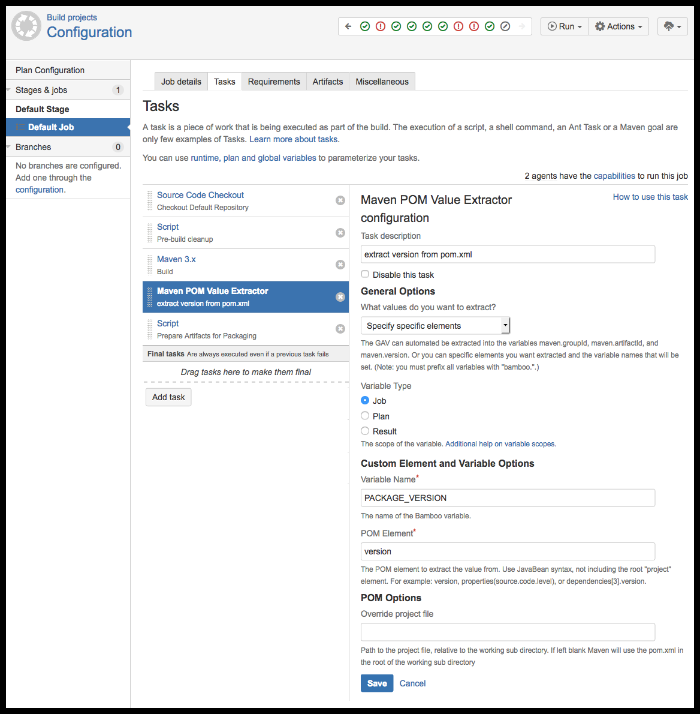
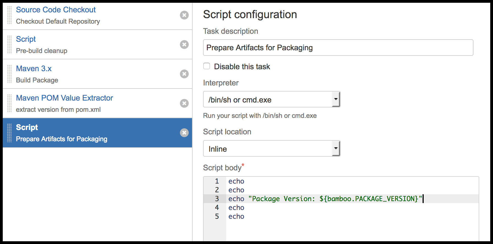

The Bamboo Maven POM Value Extractor
====================================


* The **Bamboo Maven POM Value Extractor** is an Atlassian Bamboo plugin that provides a 
  build task that extracts values from Maven POMs and sets build variables 
  using those values.
* This allows you to keep your Bamboo variables in sync with your 
  **Maven POM**.
* You can automatically extract your artifact's **GAV** or _"query"_ the POM to extract arbitrary values.


## Project URLs


* **Project Home Page and Wiki:** https://gaptap.atlassian.net/wiki/display/BAMMVNEXTR
* **Issue Tracker:** https://gaptap.atlassian.net/browse/BAMMVNEXTR
* **CI:** https://gaptap.atlassian.net/builds/browse/BAMMVNEXTR
* **Atlassian Marketplace Listing:** https://marketplace.atlassian.com/plugins/com.davidehringer.atlassian.bamboo.maven.maven-pom-parser-plugin


## Configuration

### Add the Maven POM Value Extractor to the Build Tasks

* Specify the element key to extract from the POM.
* Specify the variable to load the POM value in to.




### Use the variable name as bamboo.VARIABLE_NAME

* The variable extract from the POM can now be used in other parts of the **Build Tasks**.
* Any variable name can be referenced using: **$bamboo.VARIABLE_NAME**




## To Compile

* Use the maven install target

```shell
mvn install
```

* The resulting build artifact will be at: **target/maven-pom-parser-plugin-*.jar**


## License

* [Apache License Version 2.0, January 2004](http://www.apache.org/licenses/)


